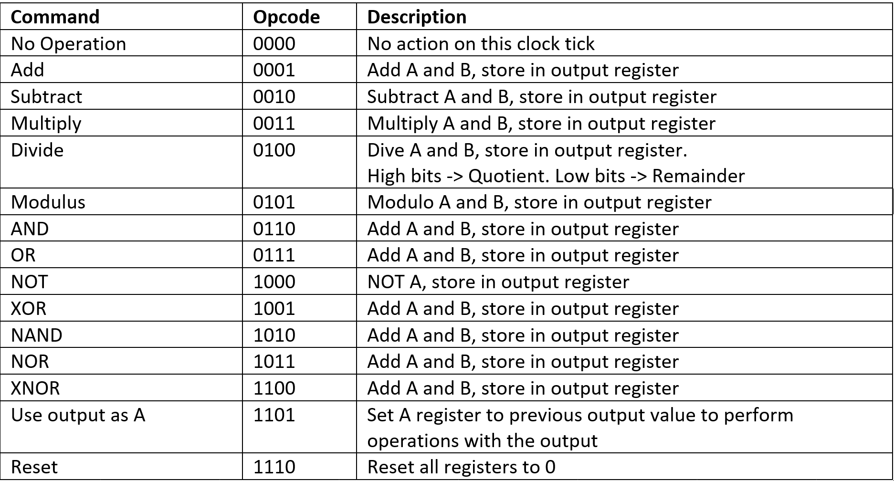
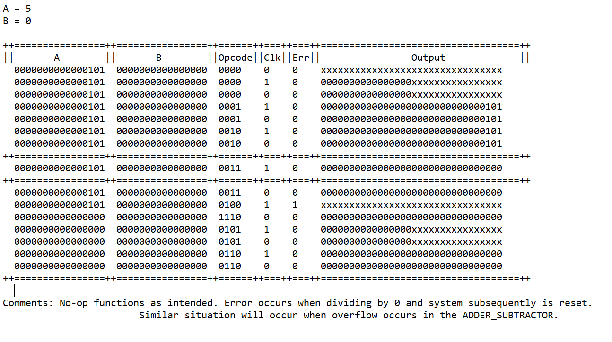

# ALU
An Arithmetic Logic Unit (ALU) designed with a combination on structural and behavioral programming styles.

Takes two 16-bit inputs, performs an operation, and returns a 32-bit ouput.

# Operations
The ALU is capable of performing the operations below. For more information, please refer to docs/High-Voltage.Split.PART4.Operations.

# Sample Run
For more runs, please refer to docs/High-Voltage.Split.PART4.output.

